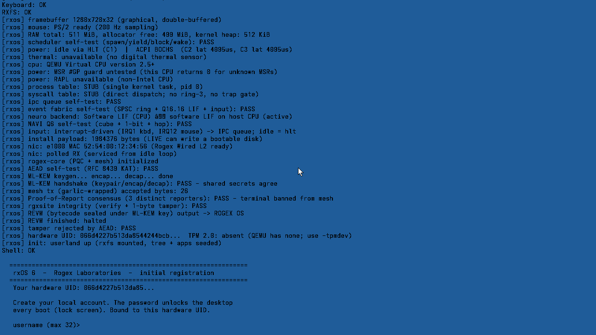
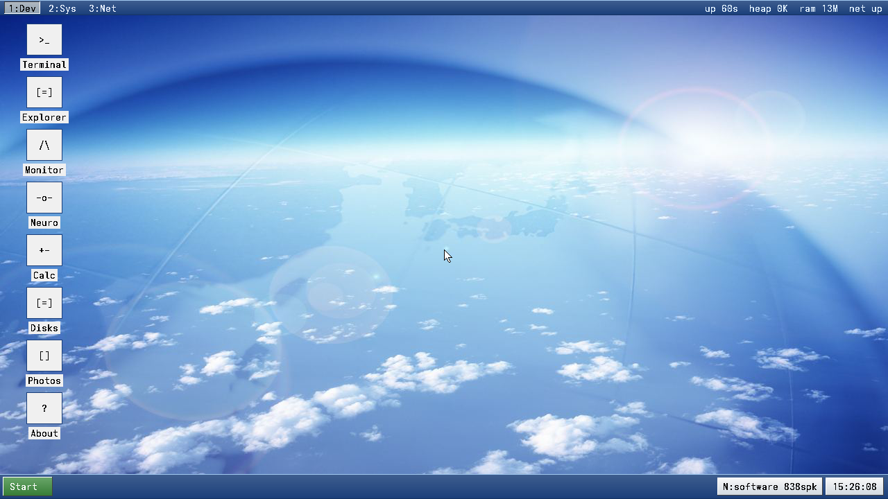
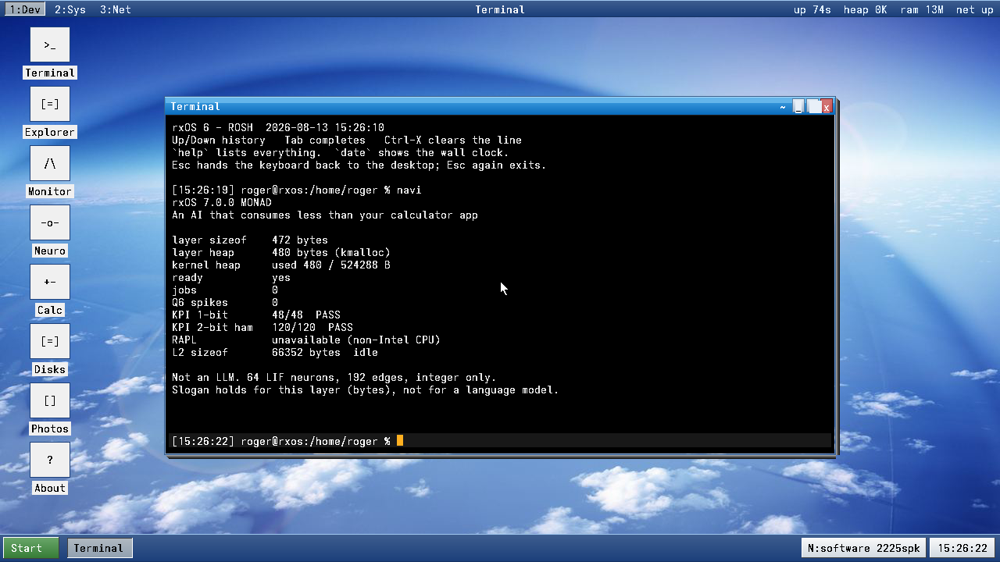
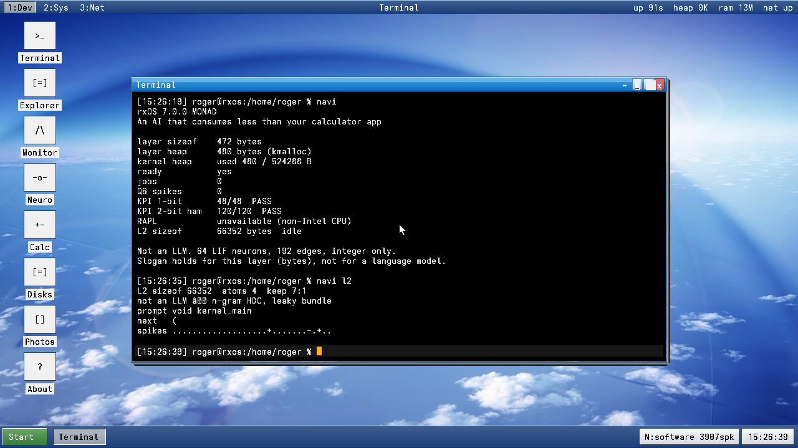
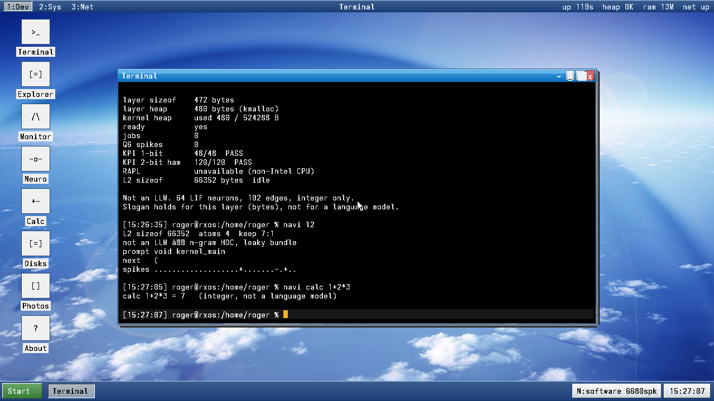
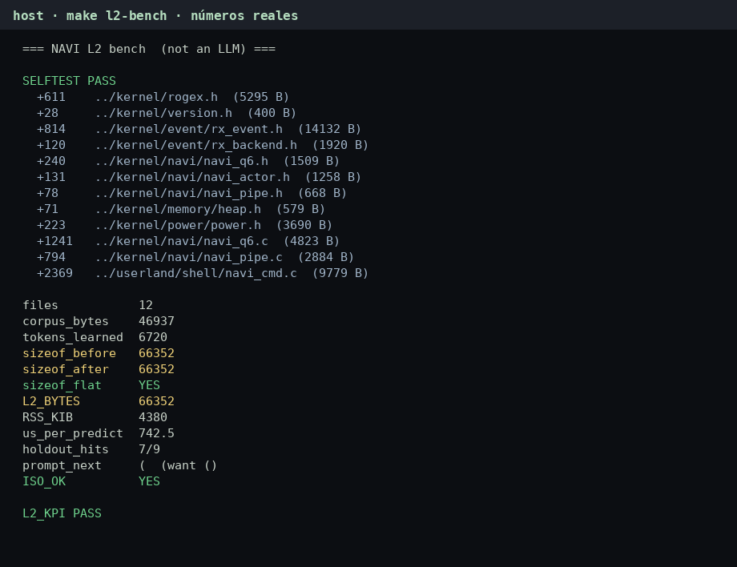
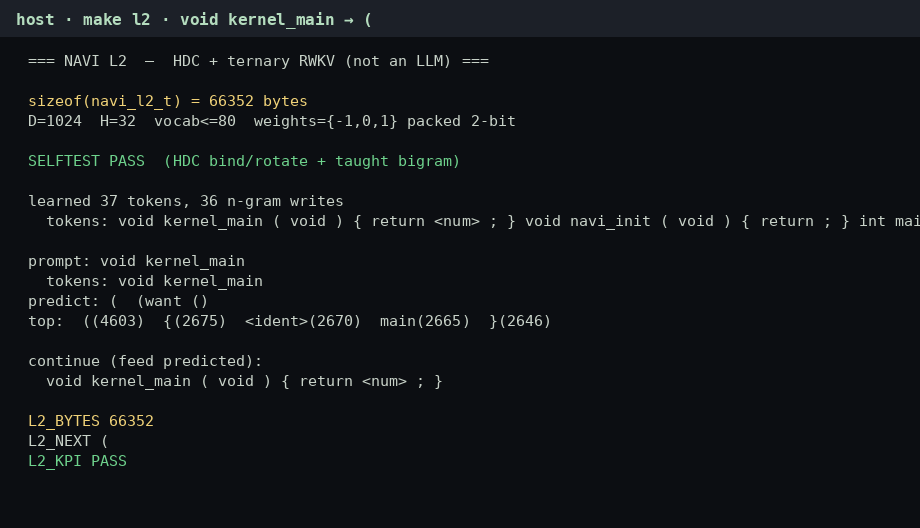

# Demostración y benches — rxOS 8 DESKTOP

**Autor:** r. navarro  
**Fecha de las capturas:** 13 ago 2026  
**Máquina de las fotos:** QEMU q35, 512 MiB, ISO `rxOS-8.0.0-vm.iso`  
**Script:** `tools/capture_navi45.py` (sesión 11–17) · `tools/capture_monad.py` (legado 01–10)

Esto es el texto para quien quiere **verlo funcionar** y repetir los números. Tono claro, tecnicismos los justos, cero teatro.

---

## 1. Qué se afirma (y qué no)

| Se afirma | No se afirma |
| --- | --- |
| L1 Q₆ corre en el kernel, self-test de boot en PASS | Que NAVI sea un modelo de lenguaje |
| 1-bit 48/48 y hop 2-bit 120/120 | Que escriba drivers nuevos |
| L2 cabe en **66 352 B** y no crece con el corpus | Julios medidos en QEMU (RAPL no está) |
| `void kernel_main` → `(` si se lo enseñaste | Que el RWKV ternario esté entrenado |

El eslogan vale para **la capa NAVI**, no para el framebuffer del escritorio.

---

## 2. Boot: el cubo se examina solo



Línea clave:

```
[rxos] NAVI Q6 self-test (cube + 1-bit + hop): PASS
```

También: event fabric PASS, heap 512 KiB, input por IRQ. `make test` lo vuelve a pedir (37 checks).

---

## 3. Escritorio vivo



Tras usuario `roger` / clave `monad`. La captura `02-registro.png` es el mismo escritorio un pelín antes (el registro ya había pasado a GUI). No hay humo: es la misma sesión.

---

## 4. L1 in-OS — telemetría



Números de esa sesión:

| Campo | Valor |
| --- | --- |
| `layer sizeof` | 472 B |
| `layer heap` | 480 B (`kmalloc`, alineado) |
| KPI 1-bit | **48/48 PASS** |
| KPI 2-bit ham | **120/120 PASS** |
| L2 sizeof | 66 352 B (aún idle) |
| RAPL | unavailable (CPU no Intel / QEMU) |

Comando: `t` y luego `navi`.

---

## 5. L2 in-OS — n-grama + spikes



```
L2 sizeof 66352  atoms 4  keep 7:1
prompt void kernel_main
next   (
spikes ...............+.......-.+..
```

Bundle leaky 7:1, 4 átomos por clase. El tamaño **no depende** de cuántas líneas hayas tragado en el host.

---

## 6. Calc entero (no es el LLM disfrazado)



`navi calc 1+2*3` → `7`. Precedencia `*` sobre `+`. Sin FPU.

---

## 7. Bench de host (corpus rxOS)

Salida real de `cd NAVI_AI_SNN && make l2-bench` (12 cabeceras/fuentes, 6 720 tokens). Render del log, no un Excel inventado:



| Métrica | Valor |
| --- | --- |
| Ficheros / bytes de corpus | 12 / 46 937 B |
| Tokens aprendidos | 6 720 |
| `sizeof` antes / después | **66 352 / 66 352** (plano) |
| RSS proceso host | 4 380 KiB (incluye libc) |
| µs / predicción | ~743 |
| Holdout | 7/9 |
| Prompt `void kernel_main` | `(` |
| `ISO_OK` | YES |

Demo corta del mismo motor:



Tras el `(` va `( void ) { return <num> ;` — es el corpus, no “inspiración”.

---

## 8. Cómo repetirlo

```bash
# ISO + smoke (incluye NAVI Q6 y L2 sizeof)
make test

# capturas de esta carpeta
python3 tools/capture_monad.py

# benches host
cd NAVI_AI_SNN
make l2
make l2-bench
```

En el OS:

```
navi
navi l2
navi l2 void kernel_main
navi calc 1+2*3
navi joules          # en QEMU se niega; en el i7-5500U, RAPL
```

---

## 9. Límites, sin postureo

- L2 no genera C que no haya visto como n-grama.
- El mezclador RWKV ternario **no está entrenado**. Si gana él, empeora. Por eso el n-grama HDC pesa ×4.
- `<ident>` aplasta todos los nombres que no están en la tabla.
- El holdout 7/9 después del corpus grande es el peaje de mezclar cabeceras. El prompt de la demo se re-enseña al final a propósito.
- Los julios no se estiman con `%` de CPU.

Si algo de lo de arriba no te cuadra, el código está en `kernel/navi/` y `NAVI_AI_SNN/l2/`. Ahí no hay slide que lo tape.
