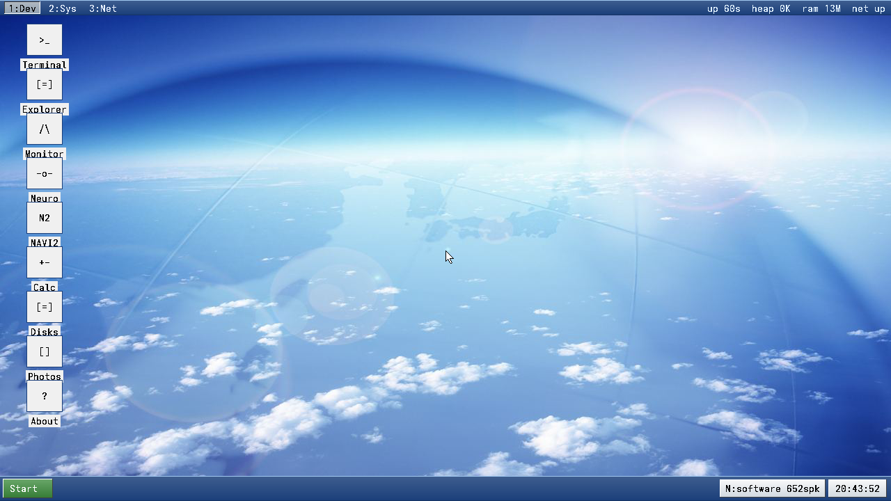

# rxOS 8 para gente curiosa (sin tesis doctoral)

**Autor:** r. navarro  
rxOS 8.0.0 DESKTOP · agosto 2026

Vale. Respiro. Esto **no** es ChatGPT en un pendrive.  
Es un sistema operativo que arranca en metal (o en QEMU) y lleva dentro una IA de impulsos tan pequeña que da un poco de vergüenza compararla con una app de calculadora.

El eslogan va en serio, y también va con asterisco: habla de **esta capa**, no del wallpaper ni del escritorio.

> *An AI that consumes less than your calculator app*

---

## El escritorio, para que veas que existe



Esto es el ISO `rxOS-8.0.0-vm.iso`. Aero, iconos, reloj. No es un PDF con un mockup. Es la máquina. La captura `03-desktop.png` es de la línea 7 (historia).

---

## El arranque se autoexamina (y lo dice)


Mira esa línea, que es la que importa:

`NAVI Q6 self-test (cube + 1-bit + hop): PASS`

Si falla, el OS no finge. Si pasa, el cubo de 64 estados y la corrección de 1 bit están vivos **antes** de que toques el teclado.

---

## L1: 472 bytes. Sí, bytes.

En la terminal (`t`) tiras `navi`:


Traducción humana:

- **472 bytes** es el tamaño de la capa. El heap reserva 480 porque alinea a 16.
- **48/48** = le das un estado con 1 bit tocado y recupera el original. Siempre, en esta prueba.
- **120/120** = con 2 bits rotos, acierta el vecino Hamming (la regla *hop*).
- **No es un LLM.** Lo dice el propio comando, que es de bien educados.

Una calculadora de escritorio se come 15–40 megas de RAM. Esto cabe en un mensaje de WhatsApp.

---

## L2: “void kernel_main” y te suelta el paréntesis


`navi l2` no está escribiendo un kernel. Está completando un trozo de C que **le enseñamos**. 66 352 bytes fijos, 4 cajones por símbolo, impulsos `+` `.` `-` abajo.

Si no se lo enseñaste, no se lo inventa. Eso no es un fallo: es honestidad.

---

## Calculadora de verdad (enteros, sin magia)


`1+2*3 = 7`. Precedencia bien. Cero coma flotante. Cero “déjame razonar 40 tokens”.

---

## Cómo probarlo tú (sin drama)

```bash
make iso-vm
make run          # o QEMU a mano con build/rxOS-7.0.0-vm.iso
# usuario / pass en el registro, luego tecla t
navi
navi l2
navi calc 1+2*3
```

Si quieres los números fríos (tamaño que no crece, microsegundos, corpus de cabeceras), pásate a [`demostracion.md`](demostracion.md). Ahí va el pack para quien pide pruebas, no vibes.
